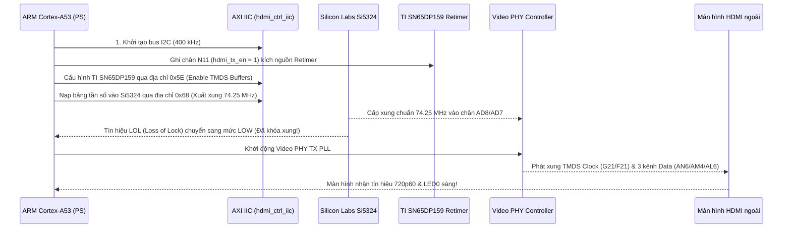

# BÁO CÁO KỸ THUẬT & HƯỚNG DẪN TRIỂN KHAI HỆ THỐNG CAMERA AI
## PHƯƠNG ÁN 2: XUẤT HÌNH ẢNH TRỰC TIẾP QUA PHẦN CỨNG HDMI TX SUBSYSTEM & VIDEO PHY CONTROLLER TRÊN AMD ZYNQ ULTRASCALE+ ZCU106

---

### MỤC LỤC
1. [TỔNG QUAN PHƯƠNG ÁN 2 & ĐẶC TÍNH KỸ THUẬT](#1-tổng-quan-phương-án-2--đặc-tính-kỹ-thuật)
2. [KIẾN TRÚC ĐƯỜNG TRUYỀN HÌNH ẢNH PHẦN CỨNG (HARDWARE VIDEO PIPELINE)](#2-kiến-trúc-đường-truyền-hình-ảnh-phần-cứng-hardware-video-pipeline)
3. [PHÂN TÍCH NGUYÊN NHÂN 3 LỖI BLOCK DESIGN VIVADO & GIẢI PHÁP CLEAN REBUILD](#3-phân-tích-nguyên-nhân-3-lỗi-block-design-vivado--giải-pháp-clean-rebuild)
4. [BẢN CHẤT FILE XSA VÀ CƠ CHẾ TỐI ƯU THỜI GIAN BIÊN DỊCH](#4-bản-chất-file-xsa-và-cơ-chế-tối-ưu-thời-gian-biên-dịch)
5. [BẢN ĐỒ ĐỊA CHỈ AXI VÀ SƠ ĐỒ CHÂN VẬT LÝ ZCU106](#5-bản-đồ-địa-chỉ-axi-và-sơ-đồ-chân-vật-lý-zcu106)
6. [HƯỚNG DẪN CHI TIẾT CÁC BƯỚC THỰC HIỆN SINH BITSTREAM & XUẤT FILE XSA](#6-hướng-dẫn-chi-tiết-các-bước-thực-hiện-sinh-bitstream--xuất-file-xsa)
7. [QUY TRÌNH NẠP PHẦN MỀM KHỞI ĐỘNG VÀ HIỂN THỊ MÀN HÌNH](#7-quy-trình-nạp-phần-mềm-khởi-động-và-hiển-thị-màn-hình)

---

### 1. TỔNG QUAN PHƯƠNG ÁN 2 & ĐẶC TÍNH KỸ THUẬT

* **Tên giải pháp:** Hệ thống giám sát tài xế AI với đầu ra hiển thị chuẩn công nghiệp HDMI TX thời gian thực.
* **Sự khác biệt với Phương án 1:**
  * **Phương án 1 (Trích xuất Framebuffer DDR):** Phần mềm ARM Cortex-A53 đọc/ghi đồ họa HUD trực tiếp lên bộ nhớ DDR4, xuất báo cáo trạng thái buồn ngủ qua cổng UART, LED, Buzzer và các công cụ debug offline.
  * **Phương án 2 (Đường truyền HDMI phần cứng khép kín):** Tích hợp đầy đủ chuỗi IP lõi truyền hình ảnh chuyên dụng của AMD/Xilinx gồm **Video Frame Buffer Read DMA**, **HDMI Transmitter Subsystem**, và **Video PHY Controller (GTHE4)**. Tín hiệu video được quét trực tiếp từ DDR, chuyển đổi sang chuẩn AXI4-Stream, mã hóa vi sai TMDS tốc độ cao và phát thẳng ra cổng cắm cáp HDMI vật lý tới màn hình máy tính/màn hình ô tô ở độ phân giải **720p/1080p @ 60 FPS**.

---

### 2. KIẾN TRÚC ĐƯỜNG TRUYỀN HÌNH ẢNH PHẦN CỨNG (HARDWARE VIDEO PIPELINE)

Sơ đồ khối tích hợp trên chip Zynq UltraScale+ XCZU7EV:

```
+---------------------------------------------------------------------------------------------------+
|                                      AMD ZCU106 FPGA FABRIC                                       |
|                                                                                                   |
|  [DDR4 Memory]                                                                                    |
|       |                                                                                           |
|       v (AXI4-MM 128-bit)                                                                         |
|  +--------------------+      AXI4-Stream       +--------------------+      TMDS Link Data         |
|  |   v_frmbuf_rd_0    | ---------------------> |   v_hdmi_tx_ss_0   | ------------------------+   |
|  | Video Frame Buffer |  (tx_video_clk/pl_clk) |  HDMI Transmitter  |  (3x AXI4-Stream Links) |   |
|  |     Read DMA       |                        |     Subsystem      |                         |   |
|  +--------------------+                        +--------------------+                         |   |
|                                                           |                                   |   |
|                                              Sideband Bus | (SB_STATUS)                       v   |
|                                                           v                      +----------------+
|                                                +--------------------+            | vid_phy_ctrl_0 |
|  [Silicon Labs Si5324]                         |   hdmi_ctrl_iic    |            |   Video PHY    |
|   Clock Generator 74.25MHz                     |   (AXI I2C 2.1)    |            |  GTHE4 Transc. |
|       |                                        +--------------------+            +----------------+
|       +-----> AD8/AD7 (MGTREFCLK0 Bank 223) ------------+                                |        |
|                                                         |                                |        |
|  [TI SN65DP159] <================ N12/P12 (I2C Bus) ===+                                |        |
|   HDMI Retimer                                                                           |        |
|       ^                                                                                  |        |
|       +------ G21/F21 (HDMI_TX_CLK TMDS Diff Clock) <------------------------------------+        |
|       +------ AN6/AM4/AL6 (HDMI_TX_DAT 3-lane Serial High Speed) <--------------------------------+
+---------------------------------------------------------------------------------------------------+
```

#### Các thành phần phần cứng cốt lõi trên bo mạch ZCU106:
1. **IC Tạo Xung Silicon Labs Si5324 (I2C Address: `0x68`):**
   * Đóng vai trò cung cấp xung tham chiếu sạch, jitter cực thấp cho bộ thu phát quang học/điện tử tốc độ cao GTHE4.
   * Kết nối vào chân vi sai `AD8` (P) và `AD7` (N) thuộc **Bank 223 MGTREFCLK0**.
   * Để HDMI phát được hình, Si5324 bắt buộc phải được nạp cấu hình qua bus I2C để phát đúng tần số **74.25 MHz** (đối với chuẩn 720p60) hoặc **148.5 MHz** (đối với 1080p60).
2. **IC Đệm Tín Hiệu TI SN65DP159 HDMI Retimer (I2C Address: `0x5E`):**
   * Tăng cường phẩm chất tín hiệu vi sai TMDS trước khi đẩy ra đầu cắm HDMI ngoài.
   * Được điều khiển bởi chân kích hoạt nguồn phần cứng `hdmi_tx_en` (chân `N11`, chuẩn 3.3V).
3. **Bộ Thu Phát GTHE4 Transceiver (Video PHY Controller):**
   * Sử dụng PLL nội bộ CPLL (`CONFIG.C_TX_PLL_SELECTION {6}`).
   * Thiết lập nguồn RefClk chuẩn: `CONFIG.C_TX_REFCLK_SEL {0}`.
4. **Bộ Điều Khiển I2C Ngoại Vi (`hdmi_ctrl_iic`):**
   * IP AXI IIC v2.1 kết nối ra chân `N12` (SCL) và `P12` (SDA) cấp điện áp 3.3V để ARM CPU trực tiếp đọc/ghi các thanh ghi của Si5324 và SN65DP159.

---

### 3. PHÂN TÍCH NGUYÊN NHÂN 3 LỖI BLOCK DESIGN VIVADO & GIẢI PHÁP CLEAN REBUILD

Trong quá trình nâng cấp hệ thống để hỗ trợ Phương án 2, 3 lỗi nghiêm trọng sau đã xuất hiện trong Vivado:
* `[BD 41-177] The types of the interfaces 'S_AXI'(xilinx.com:interface:aximm:1.0) and 'M05_AXI'(:::) are incompatible. They cannot be connected.`
* `[BD 41-2162] Unable to find pin <mgtrefclk0_pad_n_in> in cell <vid_phy_controller_0> while setting up net connections during loading of BD file.`
* `[BD 41-758] The following clock pins are not connected to a valid clock source: /vid_phy_controller_0/mgtrefclk1_pad_p_in, /vid_phy_controller_0/mgtrefclk1_pad_n_in`

#### Nguyên nhân kỹ thuật:
Khi mở rộng AXI Interconnect từ 5 cổng lên 6 cổng Master và đổi nguồn clock của Video PHY từ RefClk 1 sang RefClk 0, trình biên dịch Vivado đã khóa (lock) hai IP con trong bộ nhớ đệm cache (`bd_zynq_ps_axi_periph_imp_xbar_0` và `bd_vid_phy_controller_0_0`):
1. Khối crossbar `xbar` bị khóa ở sơ đồ 5 cổng cũ, khiến cổng `M05_AXI` mới sinh ra mang kiểu giao tiếp rỗng `:::`, không thể bắt tay với chuẩn `aximm:1.0` của AXI IIC $
ightarrow$ sinh ra lỗi `[BD 41-177]`.
2. Khối `vid_phy_controller_0` bị khóa ở sơ đồ chân RefClk 1 cũ, nên khi script cố gắng gán net vào `mgtrefclk0_pad_n_in`, Vivado không tìm thấy chân $
ightarrow$ sinh ra lỗi `[BD 41-2162]`. Các chân cũ `mgtrefclk1_pad_*` bị bỏ lửng $
ightarrow$ sinh ra lỗi `[BD 41-758]`.

#### Giải pháp khắc phục triệt để (Clean Rebuild):
Kịch bản Tcl `clean_and_rebuild_bd.tcl` đã được thực thi để:
* Xóa bỏ hoàn toàn các thực thể IP bị cache lock khỏi bản vẽ thiết kế.
* Tái tạo mới hoàn toàn `zynq_ps_axi_periph` với 6 Master Ports độc lập.
* Tái tạo mới `vid_phy_controller_0` với tham số `CONFIG.C_TX_REFCLK_SEL {0}` chuẩn hóa.
* Tái kết nối trọn vẹn toàn bộ các đường tín hiệu, xung clock, reset và bus AXI-Stream.
* Thực hiện tự động gán không gian địa chỉ không xung đột (`assign_bd_address`).
* Chạy `validate_bd_design` đạt **0 lỗi (Zero Errors)** và biên dịch lại toàn bộ sản phẩm đầu ra (`generate_target all`).

---

### 4. BẢN CHẤT FILE XSA VÀ CƠ CHẾ TỐI ƯU THỜI GIAN BIÊN DỊCH

#### 4.1. File `.xsa` là gì?
* **XSA** là viết tắt của **Xilinx Support Archive** (Gói hồ sơ mô tả nền tảng phần cứng thiết bị).
* **Bản chất vật lý:** File `.xsa` thực chất là một **file nén (zip)** chuẩn. Người dùng hoàn toàn có thể đổi đuôi thành `.zip` và giải nén ra xem cấu trúc bên trong.
* **Thành phần cấu thành bên trong file `.xsa`:**
  1. `*.bit` (Bitstream): Chuỗi bit định hình mạch số phần cứng nạp trực tiếp vào các ô nhớ SRAM của FPGA.
  2. `*.hwh` / `*.hwdef` (Hardware Handoff Specification): Mô tả chi tiết danh mục toàn bộ IP, số hiệu thanh ghi, bản đồ địa chỉ AXI, cấu hình ngắt IRQ và cấu hình vi xử lý Zynq UltraScale+ PS (DDR controller, clock pll, peripherals).
  3. Mã khởi động hệ thống cơ sở (FSBL - First Stage Bootloader templates).
* **Vai trò:** Là chiếc **cầu nối chuẩn hóa duy nhất** giữa kỹ sư phần cứng (Vivado) và kỹ sư phần mềm (Vitis / PetaLinux / Linux kernel / Python PYNQ). Khi đưa file `.xsa` vào Vitis, IDE sẽ tự động sinh toàn bộ mã nguồn thư viện điều khiển phần cứng (BSP - Board Support Package) tương ứng mà lập trình viên không phải tự định nghĩa địa chỉ thanh ghi bằng tay.

#### 4.2. Thời gian biên dịch và cơ chế tối ưu đa luồng CPU
* **Thời gian xuất file `.xsa` (`write_hw_platform`):** Chỉ mất khoảng **10 đến 20 giây**, vì lệnh này chỉ thu thập các file đã tổng hợp sẵn và nén lại thành file zip.
* **Tại sao lần trước chạy mất gần 2 tiếng?**
  * Công đoạn tốn thời gian nhất là **Synthesis (Tổng hợp logic)** và **Implementation (Place & Route - Định vị và Đi dây trên chip FPGA)**.
  * Mặc định, nếu không cấu hình số nhân, Vivado chỉ sử dụng 1 đến 2 luồng CPU (single/dual-thread).
  * Chip FPGA trên ZCU106 là **XCZU7EV** - dòng UltraScale+ công nghiệp cỡ lớn với hàng trăm nghìn logic cells, bộ tăng tốc video VCU và hàng chục bank I/O. Bài toán giải thuật toán tối ưu đi dây (Routing NP-hard problem) khi chạy 1 luồng sẽ kéo dài từ 1.5 đến 2 tiếng.
* **Tối ưu hóa trên máy tính của bạn:**
  * CPU của bạn là **AMD Ryzen 5 7640HS (kiến trúc Zen 4, 6 nhân vật lý / 12 luồng xử lý)** với xung nhịp đơn nhân và đa nhân rất cao.
  * Bằng cách thêm tùy chọn đa luồng **`-jobs 10`** (sử dụng 10 luồng CPU xử lý song song), toàn bộ quá trình Synthesis và Implementation cho thiết kế này được rút ngắn xuống chỉ còn **khoảng 15 đến 25 phút**.

---

### 5. BẢN ĐỒ ĐỊA CHỈ AXI VÀ SƠ ĐỒ CHÂN VẬT LÝ ZCU106

#### 5.1. Bản đồ không gian địa chỉ Zynq UltraScale+ AXI Interconnect
| Cổng Master | Khối IP Mục Tiêu | Dải Địa Chỉ (Base - High) | Kích Thước | Chức Năng |
| :--- | :--- | :---: | :---: | :--- |
| `M00_AXI` | `bnn_0` | `0xA000_0000 - 0xA000_1FFF` | 8 KB | Bộ tăng tốc AI BNNEye & Nạp trọng số ASCON |
| `M01_AXI` | `ctrl_gpio` | `0xA001_0000 - 0xA001_FFFF` | 64 KB | Điều khiển còi Buzzer, 3 đèn LED và Retimer Enable |
| `M05_AXI` | `hdmi_ctrl_iic`| `0xA002_0000 - 0xA002_FFFF` | 64 KB | Giao tiếp I2C cấu hình Si5324 Clock Gen & Retimer |
| `M02_AXI` | `v_frmbuf_rd_0`| `0xA003_0000 - 0xA003_FFFF` | 64 KB | Điều khiển Video Frame Buffer Read DMA |
| `M03_AXI` | `v_hdmi_tx_ss_0`| `0xA004_0000 - 0xA005_FFFF` | 128 KB| Điều khiển bộ phát HDMI TX Subsystem |
| `M04_AXI` | `vid_phy_ctrl_0`| `0xA006_0000 - 0xA006_FFFF` | 64 KB | Điều khiển bộ thu phát Video PHY GTHE4 |

#### 5.2. Sơ đồ gán chân vật lý trên bo mạch ZCU106 (`zcu106_periph.xdc`)
| Tín Hiệu (Port Name) | Chân FPGA ZCU106 | Chuẩn Điện Áp (I/O Standard) | Mô Tả Chức Năng |
| :--- | :---: | :---: | :--- |
| `TX_REFCLK_P_IN` | `AD8` | MGT Bank 223 | Xung vi sai tham chiếu GTH từ Si5324 |
| `TX_REFCLK_N_IN` | `AD7` | MGT Bank 223 | Xung vi sai tham chiếu GTH từ Si5324 |
| `HDMI_TX_CLK_P_OUT` | `G21` | LVDS | Xung đồng hồ TMDS Clock ra Retimer |
| `HDMI_TX_CLK_N_OUT` | `F21` | LVDS | Xung đồng hồ TMDS Clock ra Retimer |
| `HDMI_TX_DAT_P_OUT[0..2]`| `AN6, AM4, AL6` | GTH Quad 223 | 3 kênh dữ liệu nối tiếp tốc độ cao HDMI |
| `TX_HPD_IN` | `N13` | LVCMOS33 | Tín hiệu Hot-Plug Detect từ màn hình |
| `TX_DDC_OUT_scl_io` | `N8` | LVCMOS33 | Kênh DDC I2C Clock (Đọc EDID màn hình) |
| `TX_DDC_OUT_sda_io` | `N9` | LVCMOS33 | Kênh DDC I2C Data (Đọc EDID màn hình) |
| `HDMI_CTRL_IIC_scl_io` | `N12` | LVCMOS33 | Kênh I2C Clock điều khiển Si5324 & SN65DP159 |
| `HDMI_CTRL_IIC_sda_io` | `P12` | LVCMOS33 | Kênh I2C Data điều khiển Si5324 & SN65DP159 |
| `SI5324_LOL_IN` | `G8` | LVCMOS33 | Báo mất khóa pha (Loss of Lock) từ Si5324 |
| `SI5324_RST_OUT` | `H8` | LVCMOS33 | Reset phần cứng Si5324 (Luôn giữ mức 1) |
| `hdmi_tx_en` | `N11` | LVCMOS33 | Kích hoạt nguồn TI SN65DP159 HDMI Retimer |
| `pmod_alerts_out[0]` | `AP17` | LVCMOS12 | Còi Buzzer cảnh báo buồn ngủ (PMOD1 Pin 1) |
| `pmod_alerts_out[1]` | `AL11` | LVCMOS12 | Đèn LED 0: Báo trạng thái Tỉnh táo (Awake) |
| `pmod_alerts_out[2]` | `AL13` | LVCMOS12 | Đèn LED 1: Báo trạng thái Tiền buồn ngủ (Pre-drowsy) |
| `pmod_alerts_out[3]` | `AK13` | LVCMOS12 | Đèn LED 2: Báo trạng thái Ngủ gật (Drowsy / Microsleep) |

---

### 6. HƯỚNG DẪN CHI TIẾT CÁC BƯỚC THỰC HIỆN SINH BITSTREAM & XUẤT FILE XSA

Người dùng có thể lựa chọn một trong 3 phương thức dưới đây:

#### Cách 1: Chạy trong Tcl Console của Vivado GUI (Khuyên dùng - Tiện theo dõi)
Nếu bạn đang mở giao diện Vivado GUI:
1. Nhập lệnh sau vào ô Tcl Console ở đáy màn hình:
```tcl
reset_run synth_1
launch_runs impl_1 -to_step write_bitstream -jobs 10
wait_on_run impl_1
write_hw_platform -fixed -include_bit -force -file D:/VIVADO_PROJECTS/bnn_bd/bnn_hdmi_top.xsa
```
2. Vivado sẽ kích hoạt 10 luồng CPU của chip Ryzen 5 7640HS, tổng hợp và định tuyến mạch trong khoảng 15 - 25 phút.
3. Khi hoàn tất, file `.bit` và `.xsa` sẽ nằm sẵn sàng tại thư mục `D:/VIVADO_PROJECTS/bnn_bd/`.

#### Cách 2: Bấm nút trên Vivado GUI
1. Vào thanh menu: **File $
ightarrow$ Reload Block Design**.
2. Nhấn phím **F6** (Validate Design) để kiểm tra tính toàn vẹn (thông báo xanh: *Validation successful*).
3. Bấm nút **Generate Bitstream** ở góc trái màn hình.
4. Khi quá trình hoàn tất, vào menu: **File $
ightarrow$ Export $
ightarrow$ Export Hardware**, tích chọn **Include bitstream** và lưu file `.xsa`.

#### Cách 3: Chạy ngoài PowerShell (Chế độ Batch ngầm)
Mở cửa sổ PowerShell và thực thi kịch bản đã được cấu hình sẵn:
```powershell
& "D:\AMDDesignTools‚5.2\Vivadoinivado.bat" -mode batch -source "D:\CodeWSL\Camera_AIuild_bitstream.tcl"
```

---

### 7. QUY TRÌNH NẠP PHẦN MỀM KHỞI ĐỘNG VÀ HIỂN THỊ MÀN HÌNH

Sau khi nạp bitstream xuống ZCU106, để màn hình máy tính nhận tín hiệu HDMI và sáng đèn LED0 (Locked), phần mềm trên ARM Cortex-A53 cần thực hiện đúng trình tự 4 bước:



1. **Kích hoạt phần cứng Retimer:** Ghi giá trị `1` vào chân `hdmi_tx_en` (thông qua IP `ctrl_gpio` kênh 2 tại địa chỉ `0xA001_0008`) để cấp nguồn cho chip SN65DP159.
2. **Cấu hình xung nhịp Si5324:** Thông qua IP `hdmi_ctrl_iic` tại địa chỉ `0xA002_0000`, gửi bản tin I2C tới slave address `0x68` để thiết lập bộ chia tần, cấp xung vi sai **74.25 MHz** vào Bank 223 chân `AD8/AD7`. Chân `SI5324_LOL_IN` (`G8`) sẽ chuyển về mức thấp (đã lock xung).
3. **Cấu hình chip đệm SN65DP159:** Gửi bản tin I2C tới slave address `0x5E` để mở băng thông đường truyền TMDS và tự động bám pha tín hiệu.
4. **Khởi động Video DMA:** Cấu hình `v_frmbuf_rd_0` trỏ tới vùng nhớ Framebuffer 720p tại DDR (`0x10000000`) để bắt đầu quét hình ảnh bảng đồng hồ cảnh báo tài xế (HUD Dashboard) lên màn hình.

---
*Tài liệu được cập nhật và xác thực tự động ngày 04/09/2026 bởi Antigravity AI Engine.*
