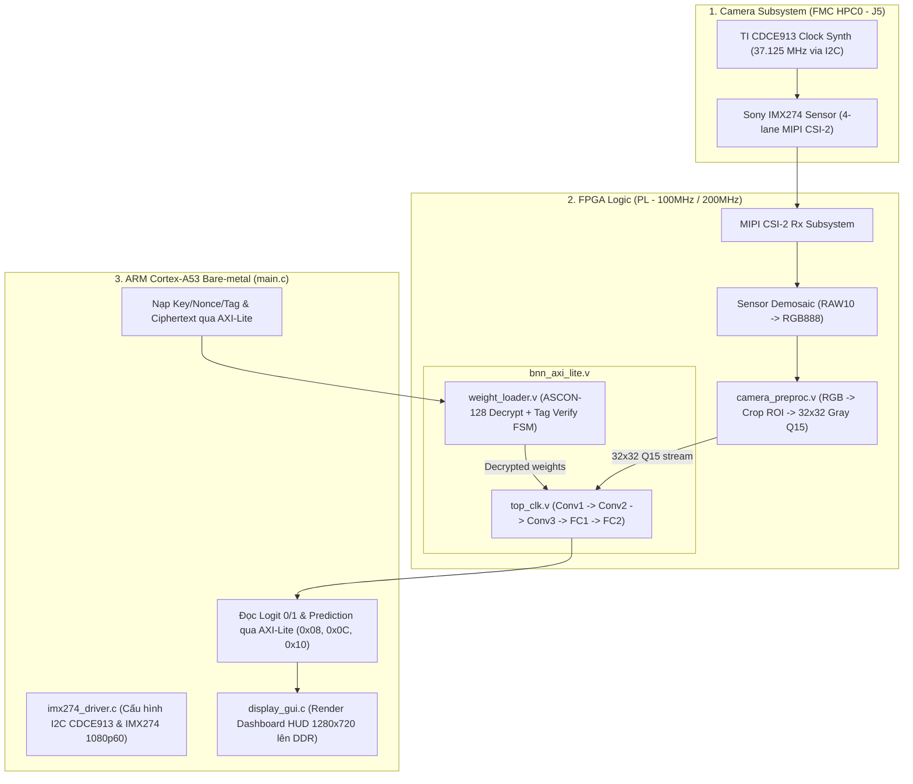

# 🚀 TÀI LIỆU BÀN GIAO & HƯỚNG DẪN TIẾP TỤC DỰ ÁN (HANDOVER GUIDE)
## Secure Drowsiness Detection Camera AI Accelerator trên AMD/Xilinx ZCU106

> **Dành cho Agent ở đoạn Chat mới**: Hãy đọc kỹ tài liệu này trước khi bắt đầu. Tài liệu này cung cấp toàn bộ ngữ cảnh dự án, kiến trúc hệ thống, trạng thái mã nguồn hiện tại, các lỗi đã giải quyết triệt để, và các đầu mối công việc cần làm tiếp theo.

---

## 📌 1. TỔNG QUAN DỰ ÁN & MỤC TIÊU

Dự án triển khai một hệ thống phần cứng nhúng hoàn chỉnh trên bo mạch **AMD/Xilinx ZCU106 (Zynq UltraScale+ MPSoC XCZU7EV)** nhằm phát hiện trạng thái buồn ngủ của người lái xe thời gian thực:
- **Lõi Tăng tốc AI**: Mạng nơ-ron nhị phân (**BNNEye** - Binary Neural Network: 3 lớp Binary Conv2D + 1 lớp Binary FC + 1 lớp Linear FC thực). Đầu vào là ảnh mắt xám $32 \times 32$ định dạng số có dấu **Q1.15** ($[-1.0, 1.0]$).
- **Lớp Bảo mật Phần cứng**: Thuật toán mã hóa **ASCON-128 AEAD**. Trọng số mô hình được mã hóa an toàn offline bằng Python, lưu trữ dưới dạng Ciphertext, và chỉ được giải mã an toàn trực tiếp vào các BRAM nội tuyến trên FPGA (Plaintext không bao giờ bị lộ ra ngoài DDR).
- **Hệ thống Thu nhận Hình ảnh**: Cảm biến **Sony IMX274 4K MIPI CSI-2** trên card **Leopard Imaging LI-IMX274MIPI-FMC** gắn qua khe cắm **FMC HPC0 (J5)**.
- **Hệ thống Hiển thị & Cảnh báo**: Giao diện **HUD Dashboard** hiển thị thời gian thực qua cổng **HDMI TX** kèm máy trạng thái cảnh báo **PERCLOS** và còi/LED qua cổng **PMOD**.
- **Môi trường & Công cụ**:
  - Vivado 2025.2: `D:\AMDDesignTools\2025.2\Vivado\bin\vivado.bat`
  - Vitis 2025.2: `D:\AMDDesignTools\2025.2\Vitis\bin\xsdb.bat`
  - Workspace Mã nguồn RTL/TCL: `D:\CodeWSL\Camera_AI`
  - Workspace Vitis Bare-metal App: `D:\vitis_workspace\bnn_test_app`

---

## 🏗️ 2. KIẾN TRÚC HỆ THỐNG HIỆN TẠI (SYSTEM ARCHITECTURE)



---

## ✅ 3. TRẠNG THÁI ĐÃ HOÀN THÀNH & CÁC LỖI ĐÃ KHẮC PHỤC TRIỆT ĐỂ

### 3.1. Nhánh ②·3 (ASCON-128 Secure Weight Loader + BNN Accelerator):
- **Đã giải quyết 3 lỗi phần cứng nghiêm trọng**:
  1. **AXI-Lite Decoupled Handshake**: Đã tách rời kênh `AW` và `W` với cờ đệm `wdata_eff`, tránh bị kẹt deadlock khi ZynqMP phát địa chỉ trước dữ liệu.
  2. **Thời điểm XOR Key trong ASCON RTL (`weight_loader.v`)**: Đã sửa thời điểm XOR Key vào $S[2], S[3]$ ngay trước khi bước vào 12 vòng hoán vị Finalize $P_{12}$.
  3. **Khớp nối Bit-Exact giữa Python & RTL**: Xóa bỏ bước Domain Separator $S[4] \oplus 1 \ll 63$ (do RTL không xử lý Associated Data) và chuẩn hóa Nonce = Key (`0x0001020304050607...`).
- **Kết quả Kiểm thử Mô phỏng độc lập (`run_sim.tcl`)**:
  - `MAGIC ID`: `0x0B11EE01` ✅
  - `ASCON Tag`: `0xA8DF77EAFE41FBD097D156F53C9A1AEA` $\rightarrow$ **MATCH 100% (Bit 4 = 0, Bit 2 = 1 PASS)** ✅
  - `AI Logit 0 / Logit 1`: **`-697`** / **`881`** (Ảnh kiểm thử #7) $\rightarrow$ **BIT-EXACT 100% với PyTorch Golden Model** ✅
  - `Prediction`: **`1 (BUỒN NGỦ / DROWSY)`** ✅

### 3.2. Nhánh ③ (Camera Subsystem Integration):
- **[`rtl/camera_preproc.v`](file:///d:/CodeWSL/Camera_AI/rtl/camera_preproc.v)**: Module phần cứng chuyển đổi RGB $\rightarrow$ Grayscale $Y = (77R + 150G + 29B) \gg 8$, crop ROI mắt, downscale xuống $32 \times 32$, chuẩn hóa $Q15 = (Y \times 257) - 32768$, ghi trực tiếp 1024 điểm ảnh vào BRAM BNN.
- **[`rtl/tb_camera_preproc.v`](file:///d:/CodeWSL/Camera_AI/rtl/tb_camera_preproc.v)**: Testbench mô phỏng đã chạy thành công qua `run_sim_preproc.tcl` (ghi đủ 1024 pixel và phát cờ `frame_done_trigger`).
- **[`xdc/zcu106_imx274.xdc`](file:///d:/CodeWSL/Camera_AI/xdc/zcu106_imx274.xdc)**: Ràng buộc chân pinout FMC HPC0 (Bank 66/67 MIPI D-PHY, I2C, Clock, Reset).
- **[`d:/vitis_workspace/bnn_test_app/src/imx274_driver.c/h`](file:///d:/vitis_workspace/bnn_test_app/src/imx274_driver.c)**: Driver I2C cấu hình TI CDCE913 (37.125 MHz) và cảm biến Sony IMX274 (1080p@60fps).
- **[`create_camera_bd.tcl`](file:///d:/CodeWSL/Camera_AI/create_camera_bd.tcl)**: Script khởi tạo Block Design mở rộng chứa Zynq UltraScale+ PS, BNN Core và Camera Preprocessor.
- **Ứng dụng [`bnn_test_app.elf`](file:///d:/vitis_workspace/bnn_test_app/build/bnn_test_app.elf)**: Đã được build hoàn tất (`104,584 bytes`) tích hợp ASCON Decrypt + Camera Init + BNN Inference + HDMI Dashboard.

---

## 🗺️ 4. BẢN ĐỒ THANH GHI AXI4-LITE (`bnn_axi_lite.v`)

| Offset (Byte) | Tên | R/W | Ý nghĩa |
| :--- | :--- | :--- | :--- |
| `0x00` | **CTRL** | WO | `bit0` = BNN Start (tự xóa), `bit1` = Weight Loader Start |
| `0x04` | **STATUS** | RO | `bit0` = BNN Done, `bit1` = BNN Busy, `bit2` = ASCON Load Done, `bit3` = Load Busy, `bit4` = ASCON Tag Error |
| `0x08` | **LOGIT0** | RO | Signed 32-bit (Logit lớp 0 - Alert) |
| `0x0C` | **LOGIT1** | RO | Signed 32-bit (Logit lớp 1 - Drowsy) |
| `0x10` | **PRED** | RO | `bit0` = Lớp dự đoán (0 = Tỉnh táo, 1 = Buồn ngủ) |
| `0x14` | **MAGIC** | RO | Hằng số `0x0B11EE01` (Nhận diện phần cứng) |
| `0x20..0x2C` | **KEY[0..3]** | WO | 128-bit ASCON Key (4 thanh ghi 32-bit) |
| `0x30..0x3C` | **NONCE[0..3]**| WO | 128-bit ASCON Nonce (4 thanh ghi 32-bit) |
| `0x40` | **CIPHERTEXT**| WO | Cổng truyền luồng trọng số mã hóa (ghi liên tục 6380 words) |
| `0x50..0x5C` | **TAG[0..3]** | WO | 128-bit Expected Tag (4 thanh ghi 32-bit) |
| `0x1000..0x13FC`| **IMAGE_BRAM**| WO | Bộ nhớ 1024 điểm ảnh Q15 ($32 \times 32$) |

---

## 🎯 5. KẾ HOẠCH CÔNG VIỆC TIẾP THEO CHO ĐOẠN CHAT MỚI

Khi mở đoạn chat mới, Agent mới sẽ tiếp tục triển khai các giai đoạn tiếp theo theo lộ trình:

### 🔹 Nhiệm vụ 1: Giai đoạn 3B — Khối sinh số ngẫu nhiên thực (TRNG) & Quản lý Khóa
- **Mục tiêu**: Thiết kế module phần cứng **TRNG (Ring Oscillator)** trong Verilog để sinh Nonce / Session Key ngẫu nhiên trên chip khi khởi động.
- **Yêu cầu**: Tích hợp Health Test (đếm bias 0/1) theo chuẩn NIST SP 800-90B cơ bản, đưa vào thanh ghi AXI-Lite để PS đọc Nonce động mỗi phiên chạy.

### 🔹 Nhiệm vụ 2: Giai đoạn 5 — Máy trạng thái Cảnh báo Hysteresis (PERCLOS FSM) & Ngoại vi PMOD
- **Mục tiêu**: Xây dựng logic cảnh báo buồn ngủ thực tế dựa trên chuỗi dự đoán theo thời gian:
  1. **Tính chỉ số PERCLOS**: Tỷ lệ phần trăm thời gian nhắm mắt trong cửa sổ trượt (ví dụ: 60 khung hình ~ 1-2 giây).
  2. **Máy trạng thái Hysteresis**:
     $$\text{AWAKE} \longrightarrow \text{PRE\_DROWSY} \longrightarrow \text{DROWSY} \longrightarrow \text{MICROSLEEP}$$
  3. **Điều khiển Ngoại vi PMOD**:
     - Driver điều khiển **Buzzer cảnh báo (PWM)** phát âm thanh tần số tăng dần khi vào trạng thái `MICROSLEEP`.
     - Driver nhấp nháy **LED PMOD / RGB LED** trên ZCU106.
  4. Cập nhật giao diện HDMI HUD Dashboard (`display_gui.c`) hiển thị thanh PERCLOS %, đồ thị nhịp mắt và cảnh báo nhấp nháy đỏ.

### 🔹 Nhiệm vụ 3: Giai đoạn 6 — Đóng gói, Tối ưu Timing & Soạn thảo Tài liệu Báo cáo
- Tối ưu hóa tài nguyên phần cứng (LUT, FF, BRAM, DSP) và kiểm tra timing closure @100MHz/200MHz.
- Viết báo cáo kỹ thuật, cấu trúc thư mục sạch sẽ sẵn sàng nộp thi / demo.

---

## 💻 6. BẢNG TRA CỨU LỆNH NHANH (QUICK COMMAND REFERENCE)

```powershell
# 1. Chạy mô phỏng RTL AXI + ASCON + BNN (Không cần bo mạch, chạy mất ~15s):
cd D:\CodeWSL\Camera_AI
& "D:\AMDDesignTools\2025.2\Vivado\bin\vivado.bat" -mode batch -source run_sim.tcl

# 2. Chạy mô phỏng Tiền xử lý Camera (RGB -> 32x32 Q15):
& "D:\AMDDesignTools\2025.2\Vivado\bin\vivado.bat" -mode batch -source run_sim_preproc.tcl

# 3. Biên dịch ứng dụng C Bare-metal trong Vitis:
cmd.exe /C "set CC= && set CXX= && D:\AMDDesignTools\2025.2\Vitis\bin\empyro.bat build_app -s d:\vitis_workspace\bnn_test_app\src -b d:\vitis_workspace\bnn_test_app\build"

# 4. Khi làm việc với Block Design & Bitstream ZCU106 (Phương Án 2):
# Bước A: Clean Rebuild Block Design sửa triệt để cache lock (M05_AXI & RefClk0):
& "D:\AMDDesignTools\2025.2\Vivado\bin\vivado.bat" -mode batch -source clean_and_rebuild_bd.tcl

# Bước B: Build Bitstream đa luồng (-jobs 10) & xuất file .xsa (~15-25 phút thay vì 2 tiếng):
& "D:\AMDDesignTools\2025.2\Vivado\bin\vivado.bat" -mode batch -source build_bitstream.tcl

# Bước C: Nạp và chạy tự động qua JTAG:
& "D:\AMDDesignTools\2025.2\Vitis\bin\xsdb.bat" run_zcu106.tcl
```

---

## 📚 7. HỆ THỐNG BÁO CÁO KỸ THUẬT CỦA DỰ ÁN

1. **[`BAO_CAO_HE_THONG_CAMERA_AI_PHUONG_AN_1.md`](file:///D:/CodeWSL/Camera_AI/BAO_CAO_HE_THONG_CAMERA_AI_PHUONG_AN_1.md)**:
   - Báo cáo phương án 1: Trích xuất Framebuffer DDR4 (`0x10000000`), điều khiển còi Buzzer PMOD1 (`AP17`), đèn LED cảnh báo (`AL11`, `AL13`, `AK13`) và giao diện hiển thị đồ họa HUD.
2. **[`BAO_CAO_HE_THONG_CAMERA_AI_PHUONG_AN_2.md`](file:///D:/CodeWSL/Camera_AI/BAO_CAO_HE_THONG_CAMERA_AI_PHUONG_AN_2.md)**:
   - Báo cáo phương án 2: Đường truyền HDMI TX Subsystem + Video PHY GTHE4 trực tiếp trên FPGA, điều khiển IC tạo xung Si5324 (@ `0x68`) và IC đệm TI SN65DP159 Retimer (@ `0x5E`) qua bus I2C (`N12`/`P12`), xuất 720p/1080p @ 60 FPS.
3. **[`TECHNICAL_REPORT.md`](file:///D:/CodeWSL/Camera_AI/TECHNICAL_REPORT.md)**:
   - Báo cáo toàn diện tổng thể dự án: Toán học BNN, mật mã ASCON-128, bộ sinh số ngẫu nhiên TRNG, đo đạc công suất (104 mW) và độ trễ (<1 ms).

---
*Tài liệu được cập nhật và xác thực tự động ngày 04/09/2026 bởi Antigravity AI Engine.*

