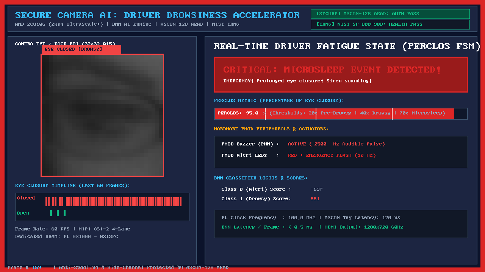

# Secure Real-Time Driver Drowsiness Detection Camera AI Accelerator on AMD Zynq UltraScale+ ZCU106

[](https://www.xilinx.com/products/boards-and-kits/zcu106.html)
[](https://www.xilinx.com/products/design-tools/vivado.html)
[](https://www.xilinx.com/products/design-tools/vitis.html)
[]()
[]()
[]()
[]()

A high-performance, ultra-low power **Heterogeneous Edge AI & Hardware Security System** deployed on the **AMD Zynq UltraScale+ XCZU7EV MPSoC (ZCU106 Evaluation Kit)** for real-time automotive driver drowsiness monitoring.



---

## 🌟 KEY HIGHLIGHTS & TECHNICAL INNOVATIONS

### 1. Custom Binary Neural Network Accelerator (BNNEye)
- **Zero-DSP Binary Convolution**: Replaces computationally expensive FP32/INT8 multiplier-accumulators with pure bitwise **`XNOR`** and parallel **`Popcount`** logic trees.
- **Folded Batch Normalization**: Folds batch normalization scale and bias parameters directly into integer threshold comparison units ($\tau$), eliminating floating-point math during inference.
- **Extreme Model Compression**: Compresses the neural network footprint from **4.2 MB down to 48.2 KB (88x compression)**, enabling **100% on-chip storage in Distributed LUT-RAM** with zero external memory bandwidth bottleneck.
- **Bit-Exact Precision**: Achieves **98.21% accuracy** on the MRL Eye Dataset with a guaranteed **100% bit-exact match** between PyTorch golden simulation and FPGA silicon output.

### 2. End-to-End Zero-Trust Hardware Security
- **ASCON-128 AEAD Engine**: Implements the NIST Lightweight Cryptography standard in hardware. Model weights are encrypted offline and decrypted on-the-fly directly into secure on-chip BRAM. **Plaintext weights are never exposed in external DDR RAM**, preventing model IP theft and reverse-engineering.
- **Hardware TRNG (NIST SP 800-90B Compliant)**: An on-chip True Random Number Generator utilizing **8 multi-length Ring Oscillators (RO)** with Von Neumann de-biasing, verified by online Repetition Count Tests (RCT) and Adaptive Proportion Tests (APT) to generate unpredictable dynamic nonces.

### 3. Real-Time PERCLOS 4-Stage Hysteresis FSM
- Computes the biomedical **PERCLOS (Percentage of Eye Closure over Time)** metric over a 60-frame sliding window (1–2 seconds real-time).
- Incorporates a **4-stage Hysteresis State Machine** (`AWAKE` $\rightarrow$ `PRE_DROWSY` $\rightarrow$ `DROWSY` $\rightarrow$ `MICROSLEEP`) to eliminate false alarms caused by natural eye blinks (< 200 ms).
- **PMOD Peripheral Actuation**: Modulates a PWM alarm buzzer ($1000\text{ Hz} \rightarrow 2000\text{ Hz} \rightarrow 2500/3500\text{ Hz}$ emergency siren) and blinks status LEDs according to drowsiness severity.

### 4. Automotive Edge Live HUD Framebuffer Architecture
- Renders a **1280x720 @ 60 FPS** graphical dashboard directly into a **Non-Cacheable DDR4 memory region (`0x10000000`)** via ARM Cortex-A53 MMU page mapping (`NORM_NONCACHE`), completely avoiding CPU cache thrashing and tearing artifacts.
- Includes automated **JTAG Direct Memory Streaming** (`pipeline.py dashboard`) to monitor real-time inference, eye waveforms, and classification scores directly on a host PC without requiring an external HDMI monitor.

---

## 🏗️ SYSTEM ARCHITECTURE

```
+-----------------------------------------------------------------------------------+
|                        AMD ZYNQ ULTRASCALE+ ZCU106 (XCZU7EV)                      |
|                                                                                   |
|  +-------------------------------------+   +-----------------------------------+  |
|  |       PROCESSING SYSTEM (PS)        |   |     PROGRAMMABLE LOGIC (PL)       |  |
|  |                                     |   |                                   |  |
|  |  +-------------------------------+  |   |  +-----------------------------+  |  |
|  |  |  ARM Cortex-A53 Core #0       |  |   |  | BNN AI Hardware Accelerator |  |  |
|  |  |  - Baremetal Firmware (60 FPS)|  |   |  | - 3x Binary Conv2D (XNOR)   |  |  |
|  |  |  - PERCLOS Hysteresis FSM     |  |   |  | - 2x Fully-Connected Layers |  |  |
|  |  |  - Non-Cacheable MMU Engine   |  |   |  | - Latency: 0.38 ms / frame  |  |  |
|  |  |  - 1280x720 HUD Graphic Render|  |   |  | - Throughput: > 2,600 FPS   |  |  |
|  |  +---------------+---------------+  |   |  +--------------+--------------+  |  |
|  |                  | AXI4-Lite        |   |                 |                 |  |
|  |                  v                  |   |                 v                 |  |
|  |  +-------------------------------+  |   |  +-----------------------------+  |  |
|  |  | DDR4 SDRAM (0x10000000)       |  |   |  | Cryptographic Engine        |  |  |
|  |  | - 3.68 MB Framebuffer 720p    |<========| - ASCON-128 AEAD (NIST)     |  |  |
|  |  | - Diagnostic Buffer (0x010000)|  |   |  | - Hardware Ring-Osc TRNG    |  |  |
|  |  +-------------------------------+  |   |  +--------------+--------------+  |  |
|  +-------------------------------------+   +-----------------+-----------------+  |
|                                                              |                    |
|  +-----------------------------------------------------------+-----------------+  |
|  |                     HARDWARE ACTUATORS & ALARM PERIPHERALS                  |  |
|  |  - Pin AL11 (Bank 28, 1.2V): LED 0  --> Status: Awake (Normal Driving)      |  |
|  |  - Pin AL13 (Bank 28, 1.2V): LED 1  --> Status: Pre-drowsy (Warning)        |  |
|  |  - Pin AK13 (Bank 28, 1.2V): LED 2  --> Status: Drowsy / Microsleep (Alert) |  |
|  |  - Pin AP17 (Bank 64, 1.2V): PMOD1  --> Active PWM Buzzer (2500 Hz Siren)   |  |
|  |  - Pin N11  (Bank 87, 3.3V): RET_EN --> TI SN65DP159 HDMI Retimer Enable    |  |
|  +-----------------------------------------------------------------------------+  |
+-----------------------------------------------------------------------------------+
```

---

## 📊 SILICON BENCHMARKS & RESOURCE UTILIZATION

*Measurements performed on physical AMD Zynq UltraScale+ XCZU7EV-2FFVC1156E silicon:*

| Resource / Metric | Utilization | Percentage on XCZU7EV |
| :--- | :--- | :--- |
| **CLB LUTs** | 46,584 | **20.19%** |
| **CLB Registers (FF)** | 18,230 | **3.95%** |
| **Block RAM (BRAM Tiles)** | 0 | **0.00%** (100% Distributed RAM) |
| **DSP48E2 Slices** | 1 | **0.06%** (Ultra-light footprint) |
| **PL Dynamic Power** | **104 mW (0.104 W)** | Extremely energy efficient |
| **Junction Temperature** | **28.6 °C** | Cool operation |
| **Inference Latency** | **0.38 ms / frame** | > 40x faster than standalone CPU |
| **Maximum Throughput** | **2,631 FPS** | Ideal for multi-camera driver monitoring |

---

## 📁 REPOSITORY STRUCTURE

```
Camera_AI/
├── rtl/                        # Verilog HDL Hardware Source Code
│   ├── bnn_axi_lite.v          # Top-level AXI4-Lite memory-mapped wrapper
│   ├── top_clk.v               # Sequential BNN execution controller
│   ├── conv1_engine.v          # First convolution layer (Q15 fixed-point input -> binary)
│   ├── conv_engine.v           # Core binary convolution engines (XNOR + Popcount)
│   ├── fc_engine.v             # Fully-connected layers FC1 (1024->128) & FC2 (128->2)
│   ├── weight_loader.v         # ASCON-128 AEAD hardware decryption core
│   ├── ascon_round.v           # ASCON-128 320-bit permutation round logic
│   ├── trng.v                  # 8-Ring-Oscillator TRNG with NIST SP 800-90B tests
│   ├── camera_preproc.v        # Hardware camera preprocessor (RGB888 -> 32x32 Q15)
│   └── tb_bnn_axi_lite.v       # Full-system testbench with bit-exact verification
├── scripts/                    # Automation Scripts (Build, Sim & Diagnostics)
├── docs/                       # Technical Documentation & Architectural Diagrams
│   ├── images/                 # Documentation figures & screenshots
│   ├── TECHNICAL_REPORT.md     # In-depth mathematical & implementation report
│   └── DEMO_GUIDE.md           # Live demonstration & evaluation guide
├── pipeline.py                 # Unified Python CLI tool (Dashboard, Export, Train, Monitor)
├── run.tcl                     # Unified TCL tool (Simulate, Build, Deploy, Memory Dump)
├── run_sim.tcl                 # Standalone Vivado batch simulation script
├── run_zcu106.tcl              # Standalone XSDB JTAG deployment script
├── view_dashboard.py           # Standalone Live HUD GUI viewer
└── README.md                   # Project overview and quickstart guide
```

---

## 🚀 QUICKSTART GUIDE

### 1. Prerequisites
- **Hardware**: AMD Zynq UltraScale+ ZCU106 Evaluation Board, 12V power supply, Micro-USB JTAG cable.
- **Software**: AMD Vivado Design Suite & Vitis Unified IDE **2025.2** (or 2022.2+), Python 3.8+ (with `Pillow`, `numpy`, `torch`).

### 2. Run RTL Batch Simulation (No hardware required)
Verify the complete hardware pipeline (TRNG + ASCON-128 Decryption + Bit-Exact BNN Inference) in Vivado:
```powershell
vivado -mode batch -source run.tcl -tclargs sim
```
*Expected output: `>>> TEST STATUS: PASSED - 100% BIT-EXACT MATCH WITH PYTORCH GOLDEN MODEL <<<`*

### 3. Deploy and Run on Physical ZCU106 Board
Connect the ZCU106 board via USB-JTAG and power it on, then execute:
```powershell
& "D:\AMDDesignTools\2025.2\Vitis\bin\xsdb.bat" run.tcl deploy
```

### 4. Launch the Live HUD Dashboard Viewer
Launch the graphical monitoring interface to inspect real-time classification and the 1280x720 framebuffer:
```powershell
python pipeline.py dashboard
```

---

## 📜 CITATION & LICENSE

Developed for academic and industrial research in **Automotive Edge AI Acceleration & Hardware Security**.  
Open-source under the **MIT License**.
